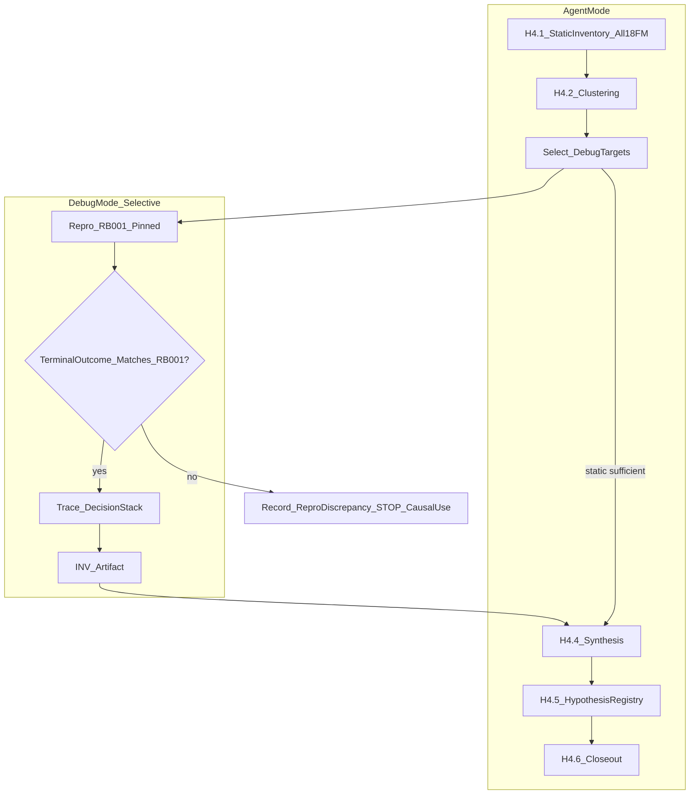

# Handover 04 Implementation Plan — Post-Baseline Forensic Analysis

[Home](../../README.md) › [Project Index](../../PROJECT_INDEX.md) › [Development](README.md) › Handover 04 Implementation Plan

> **Status:** H4.2 complete — see [H4.2 Report](Handover_04_H42_Causal_Clustering_Report.md); **H4.3 not authorized**
> **Owner:** Architecture Team
> **Applies To:** Post–Reference Baseline 001 forensic research (non-remediating)
> **Last Reviewed:** 2026-09-19
> **Predecessor:** [Handover 03 G6 Closeout](Handover_03_G6_Final_Evidence_and_Governance_Closeout_Report.md)

## Build gate

**Do not begin H4.1** (or any forensic execution, Debug sessions, reproduction runs, or tooling) until this revised plan is accepted after architect re-review and Cursor receives **explicit H4.1 authorization**.

**G0 (plan authoring)** is the only authorized activity until then.

Handover 03 is **closed**. Reference Baseline 001 is designated:

- Designation: `reference_baseline_001`
- Run: `RUN-REF-CLEAN-ANCHOR-002`
- Manifest: [`poc/experiments/baseline-evidence/REFERENCE-BASELINE-001-evidence-manifest.json`](../../poc/experiments/baseline-evidence/REFERENCE-BASELINE-001-evidence-manifest.json)

**Handover 04 does not authorize CKES remediation.** Behavioral implementation requires a subsequent explicit authorization (expected **Handover 05**).

---

## Purpose

Establish **causal** explanations for baseline failures under frozen Reference Baseline 001 measurement conditions—without changing CKES behavior, frozen benchmarks, or immutable baseline evidence.

Distinguish consistently:

| Concept | Definition |
| --- | --- |
| **Failure manifestation** | Where an incorrect result becomes visible (e.g. scorer `false_merge`, policy `admit`). |
| **Root cause** | Earliest architectural condition that **materially caused** the incorrect semantic outcome. |
| **Contributing cause** | Additional layer(s) that worsened or enabled the failure but may not be the earliest root. |
| **Downstream symptom** | Later-layer behavior that follows from an upstream cause (e.g. policy correctly applying wrong adjudication). |

**Multi-layer rule:** Do **not** force a single exclusive cause per scenario. Record **primary/root**, **contributing**, **downstream manifestations**, and **unknown/unresolved** components. Final taxonomy must quantify primary and contributing mechanisms.

---

## Non-goals

- No CKES semantic fixes, threshold tuning, prompt edits, retrieval ranking changes, or adjudication/policy changes during H4 diagnostic phases.
- No edits to frozen pack JSON, expected outcomes, or immutable run results under `g4-1-official-runs/`, `g4-official-runs/`, or designation sidecars.
- No overwrite or re-designation of Reference Baseline 001.
- No `CKES-0001`, `CKES-PAR-*` ratification, or ADR status changes from benchmark results.
- No improvement **implementation** or post-baseline **experiments** during Handover 04 (experiment **architecture** only at H4.5).

---

## Terminology (locked)

| Term | Handover 04 usage |
| --- | --- |
| Anchor Suite | Frozen pack `CKES-BENCHMARK-ANCHOR-001` v1.0.0 (input corpus) |
| Reference Baseline 001 | One designated run: `RUN-REF-CLEAN-ANCHOR-002` |
| Baseline anchors | REF-CLEAN profile, scorer, git commit, G4.1 eval infra, isolation, retrieval mode |
| Baseline evidence set | Designated Anchor run + supporting `-002` Statistical/Challenge runs |
| Supporting runs | `RUN-REF-CLEAN-STAT-002`, `RUN-REF-CLEAN-CHALLENGE-002` — **not** composite baseline |

---

## Execution model: Agent coordinates, Debug investigates selectively



- **Agent mode** owns inventory, clustering, cross-suite analysis, synthesis, hypothesis registry, governance, immutability verification.
- **Debug mode** is used when static evidence from immutable runs is **insufficient** to establish causality for a scenario or cluster representative.
- Temporary breakpoints and **disposable** tracing are permitted under the diagnostic contract once **H4.3** is authorized. **Persistent** instrumentation requires **H4.O** (separate sub-gate).

---

## Non-mutating diagnostic contract

| Forbidden during H4 diagnosis | Permitted |
| --- | --- |
| Edit production adjudication/policy/retrieval/canonicalization to test fixes | Read-only code inspection |
| Interactive threshold or prompt tuning | Breakpoints, step-through, uncommitted disposable trace scripts (revert before gate artifacts merge) |
| Change frozen benchmark content | Read release JSON only |
| Overwrite RB001 run JSON or manifest | New artifacts under `poc/experiments/forensics/` only |

---

## Decision stack (trace targets)

For each deep investigation, trace where evidence allows:

1. Benchmark projection — [`toPipelineInput`](../../poc/packages/benchmark/src/projection.ts)
2. Candidate construction — `directCandidate` / `discoverCandidates`
3. Retrieval — [`hybridRetrieve`](../../poc/packages/pipeline/src/retrieval.ts) (full ranked list when available)
4. Primary match — `matches[0]` (POC adjudication uses top match only)
5. Adjudication input and result — [`adjudicateSemantic`](../../poc/packages/pipeline/src/adjudication.ts)
6. Confidence (if exposed)
7. Policy — `@ckes/policy` [`evaluatePolicy`](../../poc/packages/policy)
8. Final decision — harness/pipeline slice outputs
9. Scorer + `evaluationCapture` — benchmark layer only

**Attribution examples (plan-level):**

- Wrong `matches[0]` → EQUIVALENT → policy admits → scorer `false_merge`: root cause may be **retrieval/ranking** (policy/scorer are manifestations).
- Correct `matches[0]` → incorrect EQUIVALENT → policy admits: root cause likely **adjudication** (retrieval not root).

---

## Reference Baseline 001 reproduction (pinned conditions)

Reproduction checklist (from evidence manifest `baselineAnchors`):

| Anchor | Value |
| --- | --- |
| Pack | `CKES-BENCHMARK-ANCHOR-001` v1.0.0, `contentHash` `2d65a6cf59c486ffba20c3571d69a918ac414f1d89d2641d25973f29e249a76c` |
| Profile | `CKES-BENCHMARK-RUN-PROFILE-REF-CLEAN-001`, hash `a69d5677856931ab7617ef64eb0072e2fb1b52254952077035d0acbcc14586de` |
| Git (recorded on run) | `956c93f9e7b2e2a519fbc8a909667df9de8f454c` |
| Eval infrastructure | `g4.1-baseline-validity-2026-09-19` |
| Database profile | `clean` (pack-only corpus reset at run start) |
| Retrieval mode | `deterministic_fixture` |
| Isolation | `concurrency: 1`, `truncate_between_scenarios` |

**Mechanism (H4.B1 build authorization):** single-scenario harness run via [`HarnessRunner`](../../poc/packages/harness/src/harness-runner.ts) `scenarioIds: ['…']` with same options as [`g41-official-execute.ts`](../../poc/scripts/g41-official-execute.ts); optional `benchmark:forensic-repro` CLI wrapper (thin, no semantic changes).

### Reproduction validity (formal rule)

A **live forensic reproduction** is valid evidence about Reference Baseline 001 behavior **only if**:

- Pinned execution conditions above are satisfied; **and**
- The reproduction’s **terminal scenario outcome** (outcome, `failureClassification`, adjudication class, policy action as recorded) **matches** the corresponding row in immutable [`RUN-REF-CLEAN-ANCHOR-002.json`](../../poc/experiments/baseline-evidence/g4-1-official-runs/RUN-REF-CLEAN-ANCHOR-002.json) (or supporting run for cross-suite work).

**If reproduction differs:**

1. **STOP** causal interpretation based on that reproduction.
2. Classify as **environment/reproducibility discrepancy**; investigate drift separately.
3. **Do not** infer original baseline root cause from a non-reproducing execution.
4. Static analysis of the **immutable** run row may continue where sufficient.

Every `INV-*` artifact must record `reproductionStatus`: `not_attempted` | `reproduced_rb001` | `repro_discrepancy`.

---

## Anchor false merges: complete accounting (18/18)

The designated Anchor run reports **18 false merges**. **Every** such scenario must receive at least a **static forensic classification** in the final dataset.

**Workflow:**

1. **Static evidence first** — immutable run + pack scenario + derived report.
2. **Causal clustering second** — group by transformation, domain, execution mode, layers.
3. **Debug selectively** — only where causality remains uncertain after static + cluster review.

**Tier 0 (mandatory deep investigation, Debug expected unless static proof is complete):**

- Critical false merges: `ANC-0017`, `ANC-0018`, `ANC-0019`, `ANC-0020`
- Must-not-match violations: `ANC-0018`, `ANC-0019`, `ANC-0020`, `ANC-0031`

**Per false-merge minimum record** (`FM-ANC-*` in `poc/experiments/forensics/anchor-false-merges/`):

| Field | Required |
| --- | --- |
| scenarioId | Yes |
| expectedSemanticOutcome | Yes (from pack; not leaked to pipeline) |
| actualOutcome | Yes (from immutable run) |
| actualMatchedIdentity | Where applicable (`evaluationCapture` / eval ref) |
| suspectedFirstDivergenceLayer | Yes |
| primaryCausalCategory | Yes (see taxonomy below) |
| contributingCausalCategories | Zero or more |
| diagnosisConfidence | high / medium / low |
| debugInvestigationRequired | boolean |
| supportingEvidenceRef | Path(s) to run row, INV, or static notes |

**Final report must list all 18** — no extrapolation from representatives only.

### Primary causal categories (taxonomy — non-exclusive contributions allowed)

- `retrieval_ranking`
- `corpus_seed_ambiguity`
- `candidate_construction`
- `missing_distinguishing_representation`
- `qualifier_context_loss`
- `adjudication`
- `confidence_calibration`
- `policy`
- `evaluation_scorer_manifestation_only`
- `benchmark_expectation_construction_limit` (epistemic — not CKES)
- `unknown_unresolved`

Quantify counts for **primary** and **contributing** categories in H4.4/H4.6.

---

## Must-not-match strengthened analysis (Anchor: 4 violations)

Scenarios: `ANC-0018`, `ANC-0019`, `ANC-0020`, `ANC-0031` (where scorer recorded violation).

For each, explicitly investigate whether the **current architecture can represent and use** evidence of semantic non-equivalence.

Classify whether the violation reflects (one or more):

- retrieval/ranking failure
- missing distinguishing representation
- qualifier/context loss
- adjudication failure
- policy failure
- absence of usable negative identity evidence
- other documented mechanism

**Do not assume** CKES needs a new negative-identity mechanism. Determine whether evidence **supports** such a hypothesis.

Distinguish:

- **Different canonical IDs** (observable identity separation), vs
- **Positive knowledge that two similar candidates must remain semantically distinct** (stronger epistemic claim).

If the latter appears useful, record as **candidate hypothesis for later governance review** — not an accepted CRA/CKES principle.

Dedicated INV records required for each of the four (may share cluster narrative but not merge into one row).

---

## Economical-AI analysis (required for every improvement hypothesis)

Handover 04 preserves the economical-AI objective ([ADR-0003](../Architecture/ADRs/ADR-0003-economical-llm-canonicalization-cascade.md), `CKES-PAR-*` provisionals).

For **every** improvement hypothesis in H4.5, document:

| Dimension | Required |
| --- | --- |
| Additional model calls | Count / trigger |
| Token/context increase | Estimate or bounded argument |
| Call granularity | per candidate / per query / per ambiguity / on-demand only |
| Scaling behavior | As corpus or ambiguity grows |
| Deterministic alternative | Could non-AI logic address the failure? |
| Reuse of prior canonical knowledge | Could stored adjudication/seeds avoid repeat AI? |
| On-demand acquisition model | Preserved or violated? |

Reject as **insufficient architecture** unless elaborated: “send more context to the LLM” or “use a stronger model” alone.

---

## Cross-suite validation (H4.4 phase)

| Suite | False-merge accounting |
| --- | --- |
| **Anchor** | **Complete** — all 18 classified |
| **Statistical** | Stratified sampling + aggregate analysis |
| **Challenge** | Stratified sampling + aggregate analysis; deferral emphasis |

Determine whether Anchor causal mechanisms:

- recur in Statistical `-002`
- recur in Challenge `-002`
- are domain-specific (culinary vs electronics)
- are transformation-specific
- are execution-mode-specific (`decision_slice` vs `full_pipeline`)
- appear unique to Anchor construction

**Do not** infer population prevalence from POC suites.

Challenge holdout remains **`process_controlled_tuning_holdout`** — not hidden, blind, or confidentiality-enforced ([`holdout-process-controlled.json`](../../poc/benchmark/generation/CKES-BENCHMARK-CHALLENGE-001/holdout-process-controlled.json)).

Preserve G2 limitation: expectations from **deterministic construction toolchain**, not independent real-world ground truth — epistemic status not upgraded.

---

## Observability sub-gate (H4.O) — separate from H4.3

If investigation shows required intermediate state is **unavailable** in immutable artifacts:

1. Document **exactly** what is missing (e.g. full retrieval rank list, confidence, prompt payload).
2. **Do not** commit persistent instrumentation during H4.3 because Debug would be easier.
3. Propose observability change under **H4.O** with architect authorization before merge to main.

H4.O is **not** part of H4.1–H4.6 automatic progression.

---

## Gate structure

| Gate | Name | Authorization |
| --- | --- | --- |
| **G0** | Plan (this document) | Amended plan submitted; **H4.1 blocked** until re-review + explicit H4.1 |
| **H4.1** | Static forensic inventory | All Anchor failures + supporting aggregates from immutable `-002` runs |
| **H4.2** | Causal clustering | All 18 FM classified (static minimum); Tier 0 flagged |
| **H4.3** | Debug-assisted investigations | Selective; non-mutating; reproduction validity enforced |
| **H4.4** | Forensic synthesis | Taxonomy, cross-suite, deferral, representation findings, observability gaps |
| **H4.5** | Improvement hypotheses & experiment architecture | **No implementation**; economical-AI + experiment isolation spec |
| **H4.6** | Governance / documentation closeout | Final package + immutability + EDF reconciliation |
| **H4.O** | Persistent observability (optional) | Separate architect OK |

---

## H4.5 — Improvement hypotheses and experiment architecture (design only)

**Does not implement improvements.**

For each evidence-supported hypothesis, record in `poc/experiments/forensics/hypotheses/HYP-*.json`:

| Field | Description |
| --- | --- |
| hypothesisId | e.g. `HYP-001` |
| causalFailureCategory | Links to taxonomy |
| supportingScenariosEvidence | IDs + INV/FM refs |
| architecturalLayerAffected | retrieval / adjudication / … |
| proposedMechanism | Concrete design sketch |
| expectedBehavioralEffect | |
| expectedFalseMergeEffect | |
| expectedMissedMatchEffect | |
| expectedDeferralEffect | |
| possibleRegressions | |
| aiCostImplications | Economical-AI section |
| craImplications | If any; non-normative |
| requiredExperiment | What would be run in H05 |
| experimentControls | Pinned packs, RB001 compare, isolation |
| successFailureCriteria | |
| metricsVsRB001 | What to compare |

### Future experiment isolation (specified now; executed in Handover 05+)

Future improvement experiments **must**:

- Never overwrite baseline runs or manifest hashes
- Use **new run IDs** and separate evidence directories
- Document exact code/config delta from baseline git `956c93f…` (or successor baseline if redesignated later)
- Use **same frozen benchmark packs** unless a **separately authorized** benchmark revision is under study
- Compare against Reference Baseline 001 (manifest hashes)
- Distinguish **behavioral** improvements from **measurement-system** changes
- Report **regressions** as well as improvements

**No experiments executed during Handover 04.**

---

## Investigation artifacts

```
poc/experiments/forensics/
  README.md
  anchor-false-merges/          # FM-ANC-* (18 rows minimum)
  investigations/               # INV-* (deep dives)
  clusters/                     # cluster registry
  hypotheses/                   # HYP-* (H4.5)
  cross-suite/                  # H4.4 summaries
  repro-discrepancies/          # when reproduction fails validity
```

### INV artifact — nine questions + reproduction status

Each `INV-*` must answer:

1. What scenario was investigated?
2. What baseline behavior was reproduced?
3. What execution path occurred?
4. At what layer did behavior first diverge from expected **semantic** outcome?
5. Root cause or downstream symptom?
6. What upstream evidence contributed?
7. What downstream behavior resulted?
8. Confidence in diagnosis?
9. What additional evidence would strengthen causality?

Plus: **`reproductionStatus`** (see reproduction validity).

---

## Debug trigger matrix (H4.3)

Use Debug when static/run JSON insufficient for layer attribution, including:

- Critical FM `ANC-0017`–`ANC-0020`
- Must-not-match mechanisms
- Representative ordinary FM per cluster
- Retrieval/ranking anomalies
- Expected identity retrieved but not selected (note: POC adjudication uses `matches[0]` only)
- Adjudication vs policy inconsistency
- Challenge unnecessary deferrals (representative scenarios)
- Any case where causality cannot be established from artifacts alone

---

## H4.6 — Final Handover 04 package (minimum contents)

Deliverable: [`Handover_04_Forensic_Analysis_Report.md`](Handover_04_Forensic_Analysis_Report.md) plus artifacts above.

Must include:

- [ ] Complete Anchor false-merge classification (**18/18**)
- [ ] Deep investigations for critical / must-not-match cases
- [ ] Causal taxonomy (primary + contributing quantification)
- [ ] Retrieval vs adjudication vs policy decomposition
- [ ] Representation-sufficiency findings (must-not-match)
- [ ] Challenge deferral analysis
- [ ] Statistical/Challenge cross-suite validation
- [ ] Observability-gap assessment
- [ ] Improvement hypothesis registry (H4.5)
- [ ] Future experiment architecture
- [ ] Economical-AI assessment per hypothesis
- [ ] Unresolved questions
- [ ] Immutability verification (`benchmark:g6-closeout` or forensic equivalent)
- [ ] EDF/governance reconciliation (indexes, optional Framework Advisor if doc volume warrants)

Optional: propose **AAR-0003** (forensic closeout) — create only during H4.6 if architect agrees.

**No CKES remediation** authorized by H4.6 completion.

---

## Immutability verification (each gate)

Verify unchanged:

- Frozen pack `contentHash` values (G3 manifest)
- `RUN-REF-CLEAN-ANCHOR-002` SHA-256 `c5e690b260f5a061b24b59bb1cb5835adbf211d5ec418ea108af2b8f752ac573`
- Designation sidecar and manifest
- No writes to `g4-1-official-runs/` or `g4-official-runs/` except new read-only forensic copies explicitly forbidden from overwriting

---

## Related documents

- [REFERENCE-BASELINE-001-evidence-report.md](../../poc/experiments/baseline-evidence/REFERENCE-BASELINE-001-evidence-report.md)
- [AAR-0002](../Architecture/Audits/AAR-0002-handover-03-reference-baseline-establishment.md)
- [Benchmark Evaluation Architecture](../Architecture/Benchmark_Evaluation_Architecture.md)
- [Economical LLM direction](../Architecture/Economical_LLM_Assisted_Canonicalization_Discovery_and_Revalidation.md)

---

## Authorization summary

| Activity | Authorized now? |
| --- | --- |
| Revised plan (this document) | Yes (G0 amendment) |
| H4.1–H4.6 execution | **No** — await explicit gate authorization |
| H4.3 Debug | **No** until H4.3 authorized |
| H4.O persistent observability | **No** until H4.O authorized |
| Handover 05 remediation | **No** |

**STOP:** Return amended plan for architect re-review. Do not begin H4.1.
